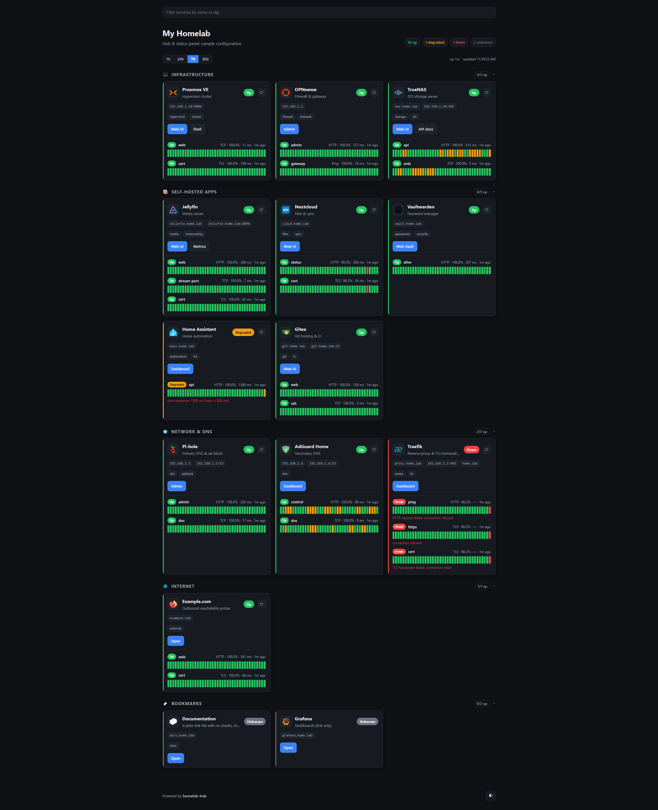
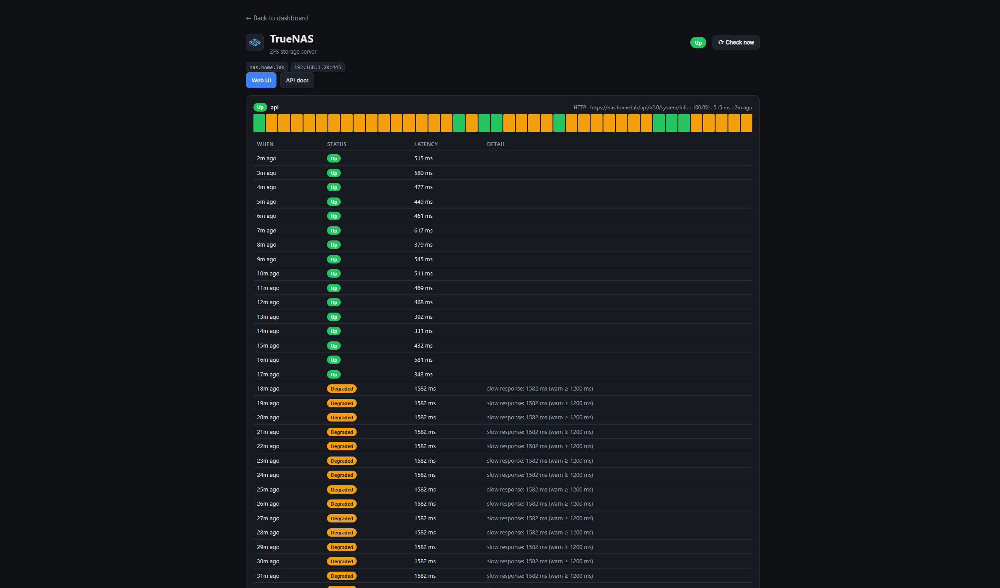

# homelab-hub

A single-binary **hub and status panel** for your homelab. Point it at one
JSON file describing your services and it gives you a dashboard of links plus
live health checks with uptime history.

<p align="center">
  
  <br>
  <sub><em>The dashboard: services grouped into cards with live status, uptime bars and one-click links.</em></sub>
</p>

<p align="center">
  
  <br>
  <sub><em>Per-service detail: a longer uptime history and a recent-events table with latency and reasons.</em></sub>
</p>

More specifically:

- a clean dashboard of links to every service, grouped, with icons, tags, and
  one-click buttons (a service can expose several links such as web UI, admin, or metrics),
- live **up / degraded / down** status from active health checks (HTTP, TCP, TLS
  cert-expiry, and optional ICMP ping), with the failure/degraded reason on hover,
- **uptime-over-time bars** and uptime % from persisted history, per-group "N/M up"
  summaries, and a per-service **detail page** with a recent-events table,
- live updates with no manual refresh (Server-Sent Events, with polling fallback),
  plus a **"Check now"** button to re-run a service's checks on demand,
- a client-side **filter box** and collapsible groups,
- a selectable history window (1h / 24h / 7d / 30d),
- **config hot-reload**: edit the JSON and the dashboard updates, no restart.

Written in Rust. The web UI (HTML/CSS/JS) is embedded in the binary, so
deployment is trivial, you just provide your `config.json`.

---

## Quick start (bare metal)

```sh
# 1. Build (single binary at target/release/homelab-hub)
cargo build --release

# 2. Create your config
cp config.example.json config.json     # then edit it

# 3. Run
./target/release/homelab-hub --config config.json --db hub.db --bind 0.0.0.0:8080
```

Open <http://localhost:8080>. Status pills turn green/red within one check
interval, and the uptime bars fill in over time.

All flags have environment-variable equivalents:

| Flag       | Env          | Default          | Description                       |
| ---------- | ------------ | ---------------- | --------------------------------- |
| `--config` | `HUB_CONFIG` | `config.json`    | Path to the services config file. |
| `--db`     | `HUB_DB`     | `hub.db`         | SQLite file for check history.    |
| `--bind`   | `HUB_BIND`   | `0.0.0.0:8080`   | Listen address.                   |
| `--demo`   | `HUB_DEMO`   | `false`          | Serve stored history only (see [Try the demo](#try-the-demo)). |

Logging is controlled with `RUST_LOG` (e.g. `RUST_LOG=info,homelab_hub=debug`).

---

## Try the demo

Want to see what it looks like before wiring up your own services? The sample
[`config.example.json`](config.example.json) points at made-up hosts (`192.168.1.x`,
`*.home.lab`) that won't be reachable from wherever you're evaluating this, so
probing them live would just paint the whole board red. Instead, **seed a database
with synthetic history** and serve it read-only:

```sh
scripts/demo.sh                 # macOS/Linux
pwsh scripts/demo.ps1           # Windows
```

That builds, seeds `demo.db` from the sample config, and serves it at
<http://127.0.0.1:8080>. Or run the two steps by hand:

```sh
cargo run --release -- seed --config config.example.json --db demo.db --reset
cargo run --release -- --config config.example.json --db demo.db --demo
```

- **`seed`** fabricates ~30 days of check history for the services in
  the config: filled uptime bars, latency, a couple of incidents, and a
  realistic up / degraded / down / unknown mix. It's deterministic, so the demo
  looks the same every time.
- **`--demo`** serves that history *without* running the live probes (which would
  mark the unreachable sample hosts down), pruning the synthetic rows, or
  hot-reloading the config.

| Option         | Default | Description |
| -------------- | ------- | ----------- |
| `seed --days`  | `30`    | Days of history to generate. |
| `seed --reset` | off     | Clear existing history first (required if the DB already has rows). |
| `--demo`       | off     | Serve stored history only; disables live checks, retention and hot-reload. |

> Point `seed`/`--demo` at your own `--config` to preview *your* layout with
> placeholder history before any real checks have run.

---

## Configuration

The config is JSON. See **[`config.example.json`](config.example.json)** for a
full sample and **[`config.schema.json`](config.schema.json)** for a JSON
Schema (add `"$schema": "./config.schema.json"` to your file for editor
autocomplete and validation).

```jsonc
{
  "title": "My Homelab",
  "subtitle": "Hub & status panel",
  "theme": "auto",                 // auto | light | dark
  "refreshInterval": 15,           // UI poll fallback (seconds) when SSE is unavailable
  "defaults": {                    // applied to any check that doesn't override them
    "interval": 30,                // seconds between checks
    "timeout": 5,                  // per-check timeout (seconds)
    "warnResponseTimeMs": 800,     // slower than this => "degraded"
    "retentionDays": 90            // how long history is kept
  },
  "groups": [
    {
      "name": "Apps",
      "services": [
        {
          "id": "jellyfin",        // optional; derived from name if omitted
          "name": "Jellyfin",
          "description": "Media server",
          "icon": "https://cdn.jsdelivr.net/gh/selfhst/icons/svg/jellyfin.svg",
          "tags": ["media"],
          "links": [
            { "label": "Web UI", "url": "https://jellyfin.home.lab", "primary": true },
            { "label": "Metrics", "url": "https://jellyfin.home.lab/metrics" }
          ],
          "checks": [
            { "name": "web", "type": "http", "target": "https://jellyfin.home.lab/health",
              "expectStatus": [200], "insecureSkipTlsVerify": true },
            { "name": "stream-port", "type": "tcp", "target": "jellyfin.home.lab:8096" }
          ]
        }
      ]
    }
  ]
}
```

**Notes**

- A service with **no `checks`** is just a link tile (status shown as *unknown*).
- A service's status is the **worst** of its checks (`down > degraded > up`).
- `icon` may be an `http(s)` URL, a **bare name** like `"jellyfin"` (resolved to
  the [selfh.st icon CDN](https://selfh.st/icons/)), or omitted (a letter avatar
  is shown). If a named icon fails to load it falls back to the letter.

### Check types

| `type` | `target`               | "Up" means…                                  | Extra options |
| ------ | ---------------------- | -------------------------------------------- | ------------- |
| `http` | `https://host/path`    | response with an accepted status code        | `method`, `expectStatus` (default `2xx`), `expectBodyContains`, `headers`, `insecureSkipTlsVerify` |
| `tcp`  | `host:port`            | the port accepts a TCP connection            | — |
| `tls`  | `host` or `host:port`  | TLS handshake succeeds and the cert is valid | `warnCertDays` (default 14; goes *degraded* as expiry nears) |
| `ping` | `host`                 | ICMP echo reply (optional, see below)        | — |

A check goes **degraded** if it is reachable but the response is slow
(`warnResponseTimeMs`), the HTTP status isn't accepted, the body assertion fails,
or a TLS cert is within `warnCertDays` of expiry. Otherwise an unreachable target
(or an expired cert) is **down**. The reason is shown on hover and on the detail page.

> `ping` requires a build with `--features ping` and raw-socket privileges
> (`CAP_NET_RAW`); it is **not** compiled in by default. Prefer `tcp`/`http`.

---

## Deployment

### systemd on an LXC / VM (recommended)

```sh
install -Dm755 target/release/homelab-hub /usr/local/bin/homelab-hub
install -Dm644 config.json                /etc/homelab-hub/config.json
install -Dm644 deploy/homelab-hub.service /etc/systemd/system/homelab-hub.service
systemctl daemon-reload
systemctl enable --now homelab-hub
journalctl -u homelab-hub -f
```

The unit uses `DynamicUser=yes` and a `StateDirectory`, so history is persisted
under `/var/lib/homelab-hub/` with no manual user setup. See
[`deploy/homelab-hub.service`](deploy/homelab-hub.service).

#### Fully static binary (optional)

For a binary with no glibc dependency:

```sh
rustup target add x86_64-unknown-linux-musl
cargo build --release --target x86_64-unknown-linux-musl
```

### Docker

```sh
docker build -f deploy/Dockerfile -t homelab-hub .
docker run -d --name homelab-hub -p 8080:8080 \
  -v "$PWD/config.json:/config/config.json:ro" \
  -v homelab-hub-data:/data \
  homelab-hub
```

### Authentication

There is **no built-in auth**. homelab-hub is meant for a trusted LAN or to sit
behind your own reverse proxy / SSO (Authelia, Authentik, Cloudflare Access, and so on).

---

## HTTP endpoints

| Path                                  | Description                                  |
| ------------------------------------- | -------------------------------------------- |
| `GET /`                               | The dashboard (accepts `?window=1h\|24h\|7d\|30d`). |
| `GET /partials/dashboard`             | Dashboard content only (used for live refresh). |
| `GET /services/{id}`                  | Per-service detail page (history + recent events). |
| `GET /events`                         | Server-Sent Events; emits on status changes. |
| `GET /api/status`                     | JSON snapshot of every check's current state. |
| `GET /api/services/{id}/history`      | JSON history for a service (`?window=24h`).   |
| `POST /api/services/{id}/check`       | Trigger an immediate re-check ("Check now"). |
| `GET /healthz`                        | Liveness probe (`ok`).                        |

---

## Development

```sh
cargo run -- seed --config config.example.json --db demo.db --reset  # build demo history
cargo run -- --config config.example.json --db demo.db --demo        # serve the demo
cargo test                                  # unit tests
cargo fmt --all                             # format
cargo clippy --all-targets -- -D warnings   # lint
```

(`cargo run -- --config config.example.json` also works, but the sample hosts
aren't reachable, so every check shows *down*; use the demo flow above to see a
populated dashboard.)

The project is pinned to stable Rust via `rust-toolchain.toml`. CI
(`.github/workflows/ci.yml`) runs fmt, clippy and tests.

### Layout

```
src/
  config/   # JSON config: parse, validate, hot-reload (notify)
  monitor/  # Checker trait + scheduler + http/tcp checkers
  store/    # SQLite history (sqlx) + retention pruning
  web/      # axum router, handlers, view models
  model.rs  # Status, CheckOutcome, HistPoint
  seed.rs   # synthetic demo-history generator (the `seed` subcommand)
templates/  # Askama templates (embedded at compile time)
assets/     # CSS/JS/icons (embedded via rust-embed)
migrations/ # SQLite schema
```

**Extending:** add a new check type by implementing the async `Checker` trait
in `src/monitor/` and registering it in `build_checker`.

## License

MIT. See [LICENSE](LICENSE).
